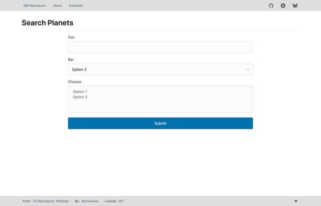
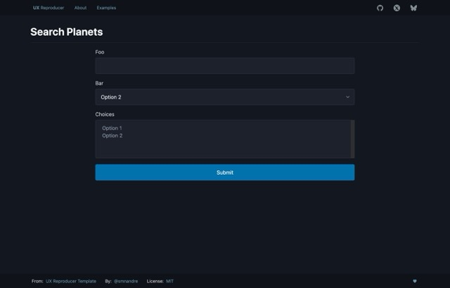

# UX Reproducer [TEMPLATE]

---

## Reproducer template

> [!IMPORTANT]
> This repository is a template for creating a bug reproducer for Symfony UX.

| Layout | Dark Mode                                         | Light Mode                                         |
|--------|---------------------------------------------------|----------------------------------------------------|
| Form   |  |  |

## How to use this template?

### GitHub website

1. Go to the [github.com/smnandre/ux-reproducer](https://github.com/smnandre/ux-reproducer) 
2. Click on the `Use this template` button
3. Follow the instructions
4. Clone the repository

### GitHub CLI

Create a new repository from this template using the GitHub CLI:

```bash
gh repo create issue-foo-bar --template=smnandre/ux-reproducer
```
